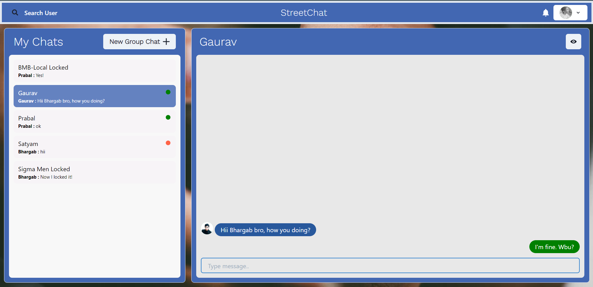
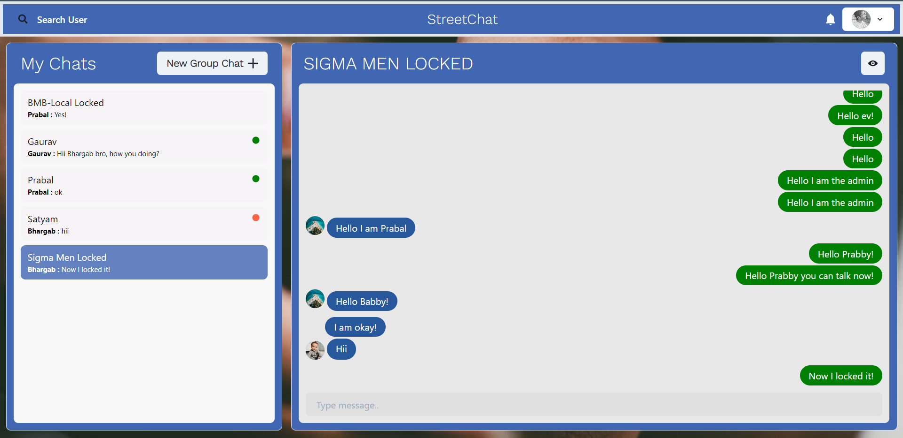
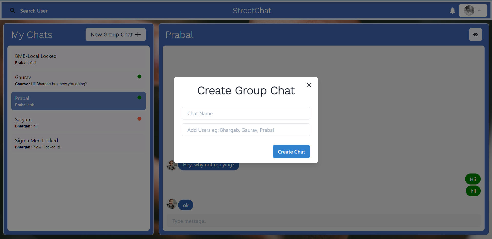

<h1 align="center">
🌐 StreetChat
</h1>
<p align="center">
A random chat app built using the <b> MERN and Socket.io </b>
</p>

> - You register yourself to the website and then login.
> - You can search user and start one-to-one conversation with the user.
> - Create a group and have group conversation.
> - Get notification(s) for all incoming messages.
> - Group Authorization is implemented, so if you are admin, you can restrict other users not allowing to send message to the group.
> - Only admin have the rights to either add another member to the group conversation or remove him or set the restriction of preventing to send message.
> - Check if your friend is online or offline.

## Clone or Download

```terminal
First clone the git repository...
$ git clone https://github.com/Bucephalus-lgtm/streetchat

In the root directory, run
$ npm i

Then change your current directory to frontend by running...
$ cd frontend/
$ npm i

If npm i throws error, please run the following command
$ npm i --legacy-peer-deps
```

# Usage (run the app on your machine)

## Prerequisites

- [MongoDB](https://gist.github.com/nrollr/9f523ae17ecdbb50311980503409aeb3)
- [Node](https://nodejs.org/en/download/) ^10.0.0
- [npm](https://nodejs.org/en/download/package-manager/)

## Client-side usage(PORT: 3000)

```terminal
$ cd frontend       
$ npm run start  
```

## Server-side usage(PORT: 5000)

### Prepare your secret

You need to create a .env file in the root directory and add all the values of the keys present in .env.example file

### Start

```terminal
// In the root directory
$ npm run dev
```

# Screenshots of this project

User sign in or sign up:


After signing in user lands on Home Page:


One-to-One chat:



Group chat(as Admin)



Group Chat(as added member in the group, if you can not send message):


Create Group Chat Modal:



## Author

[Bhargab Nath](https://github.com/Bucephalus-lgtm)
